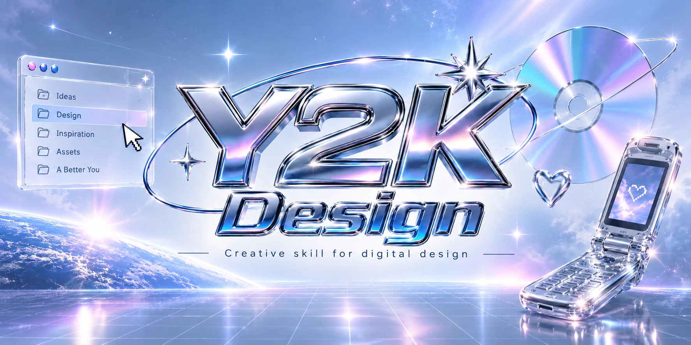

# Y2K Design Agent

[](LICENSE)
[](SKILL.md)
[](AGENTS.md)
[](.cursor/rules/y2k-design-agent.mdc)

An agent skill that makes coding agents ship interfaces that look **manufactured in 1999**, not "inspired by the 90s."

Most AI-generated Y2K is a texture pack: purple gradient, Orbitron, a glow, a sparkle emoji. This skill replaces that with art direction - an era selector, real material physics, a signature control, and a pre-flight gate that fails the output when the chrome is fake.

Works with **every major coding agent** - see the install matrix below.

---

## What it actually changes

| Without | With |
|---|---|
| Purple to cyan gradient on black | Ice and silver base, one accent, material as the interest |
| A 2-stop grey gradient called "chrome" | A reflected horizon: 5+ stops, a hard edge under 2%, unequal bands, grain |
| `Orbitron` headline, every time | A per-era type system, including period-accurate Verdana and Trebuchet stacks |
| A decorative hero animation | One signature control that changes real state |
| "Y2K vibes" | A named era (1997 / 1999 / 2001 / 2003) with its own composition, materials and motifs |
| Shine over a flat 2024 template | A grayscale test that fails the page before you see it |
| Frutiger Aero or Apple Web mixed into Y2K | An explicit adjacent mode with its own recipe and boundaries |

---

## Install - pick your agent

This repo speaks three formats so it works everywhere without translation. Clone (or copy) the
whole repo to the path your tool expects.

| Tool | Reads | Install path | Scope |
|---|---|---|---|
| **Claude Code** | `SKILL.md` | `~/.claude/skills/y2k-design-agent/` | Personal, all projects |
| **Claude Code** (project) | `SKILL.md` | `.claude/skills/y2k-design-agent/` | This project only |
| **Windsurf** | `SKILL.md` | `.windsurf/skills/y2k-design-agent/` | This project only |
| **Codex** | `SKILL.md` | `.agents/skills/y2k-design-agent/` | This project only |
| **OpenCode** | `SKILL.md` | `.opencode/skills/y2k-design-agent/` or `.agents/skills/y2k-design-agent/` | This project only |
| **Cursor** | `.cursor/rules/*.mdc` | already in this repo's `.cursor/rules/` | Copy that one file into your project's `.cursor/rules/` |
| **Everything else that reads `AGENTS.md`**: GitHub Copilot coding agent, Gemini CLI, Aider, Zed, Devin, Amp, Factory, Google Jules, RooCode, Augment, Warp, JetBrains Junie, Ona, and 15+ more | `AGENTS.md` | clone as a subfolder, e.g. `design/y2k-design-agent/`, then add one line to your project's own `AGENTS.md`: `For Y2K/millennium design briefs, read design/y2k-design-agent/AGENTS.md in full first.` | Wherever you point it |

```bash
# Claude Code, personal
git clone https://github.com/unrealretamal/y2k-design-skill.git ~/.claude/skills/y2k-design-agent

# Claude Code (project) / Windsurf / Codex - swap the destination
git clone https://github.com/unrealretamal/y2k-design-skill.git .claude/skills/y2k-design-agent
git clone https://github.com/unrealretamal/y2k-design-skill.git .windsurf/skills/y2k-design-agent
git clone https://github.com/unrealretamal/y2k-design-skill.git .agents/skills/y2k-design-agent

# OpenCode - project-local install
git clone https://github.com/unrealretamal/y2k-design-skill.git .opencode/skills/y2k-design-agent

# Cursor - copy just the rule file into your own project
curl -o .cursor/rules/y2k-design-agent.mdc \
  https://raw.githubusercontent.com/unrealretamal/y2k-design-skill/main/.cursor/rules/y2k-design-agent.mdc
```

Install the whole folder, extracted, but skip `assets/` (that's just this README's cover image, not part of the skill). The `references/` files are loaded on demand, so the always-on context cost stays small on every format.

### Why three formats instead of one

- **`SKILL.md`** is the native format for Claude Code, Windsurf, Codex and OpenCode. It has real conditional activation: the tool reads the `description` frontmatter and only pulls in the full file when a brief actually matches.
- **`.cursor/rules/*.mdc`** is Cursor's own format. With `alwaysApply: false` and no `globs`, it becomes an **Agent Requested** rule - functionally the same conditional activation as a Claude Code skill, described in [Cursor's docs](https://cursor.com/docs/rules).
- **`AGENTS.md`** is the [Linux-Foundation-governed](https://agents.md/) universal file, read natively by 25+ tools that have no skill-invocation mechanism of their own. It has no built-in conditional trigger, so it opens with an explicit self-gating instruction: apply only to Y2K briefs, ignore for everything else.

All three point at the same source of truth: `SKILL.md` plus `references/`. Edit those, and every format stays in sync.

---

## Use

Just ask. The skill triggers on Y2K, millennium, chrome metal, gel, aqua, cyber-pop, early-2000s, Frutiger Aero, Apple Web, and similar briefs. Frutiger Aero and Apple Web are explicit adjacent modes, never blended into a Y2K era.

```
Build me a Y2K landing page for a techno festival. Go hard.
Restyle this dashboard with subtle 2001 Aqua. Don't touch the routes.
Design a Y2K media player for a netlabel. Spec only, no code.
Build me a Frutiger Aero homepage for a nature-tech product.
Design an Apple Web product page with restrained translucency.
```

The agent answers with a one-line design read before writing anything:

> *Reading this as: a festival landing for 18-30 ravers, 1999 Chrome Orbital, chrome + ice glass, signature control is a lineup dial you drag.*

Override it conversationally. `"make it 2003, more plastic, less chrome"` is a valid instruction, and the dials move.

---

## Eras And Modes

| Era | Name | World |
|---|---|---|
| **1997** | Techno-Industrial | The Designers Republic, Wipeout, hazard labels, engineered and hostile |
| **1999** | Chrome Orbital *(default)* | Millennium ads, liquid metal, satellite graphics, the future arriving |
| **2001** | Aqua Lozenge | Mac OS X, iMac G3, pinstripes, professional but edible |
| **2003** | Plastic Pop | Motorola color screens, MSN, holographic stickers, cyber-kawaii |

Plus **Digital Archive**, a cross-era overlay for anything that is fundamentally a list of media.

**One era or mode per project.** Mixing them is how you get the generic metallic template this skill exists to prevent. `references/sources.md` has dated, named period references (Wipeout/The Designers Republic/Eurostile, Aqua, iMac G3, Frutiger Aero as the era that came *after*) so the boundaries aren't just asserted.

### Adjacent modes

These are explicit alternatives, not extra Y2K eras:

| Mode | Direction | Use it for |
|---|---|---|
| `FRUTIGER_AERO` | Nature-tech optimism: sky, water, glossy green, friendly system surfaces | Briefs that explicitly name Frutiger Aero or post-Y2K nature-tech |
| `APPLE_WEB` | Product communication: white space, precise type, product photography, restrained translucency | Apple, Mac Web or Apple-like product pages |

Declare `MODE` before implementation. Use only the selected recipe in [`references/visual-recipes.md`](references/visual-recipes.md). Never blend either mode with a Y2K era.

---

## What it refuses to do

Vaporwave, synthwave and cyberpunk are **different aesthetics from different decades**, and the skill says so instead of blending them in. Frutiger Aero and Apple Web are supported only as explicit adjacent modes. It also bans neon-on-black defaults, chrome on body text, fake Windows 95 chrome, sparkle emoji, autoplay audio, custom cursors, invented testimonials, and em-dashes.

The full list, with reasoning, is in [`references/anti-slop.md`](references/anti-slop.md).

---

## Repo layout

```
SKILL.md                      the philosophy, dials, and rules (always loaded)
AGENTS.md                     universal pointer for the 25+ tools that read AGENTS.md natively
.cursor/rules/y2k-design-agent.mdc   Cursor-native Agent Requested rule
references/
  visual-recipes.md           one full recipe per era and adjacent mode
  materials.md                copy-adaptable chrome / gel / aqua / frost / holo CSS
  motion.md                   timing, easings, signature-control patterns
  anti-slop.md                Y2K AI tells and the three tests
  quality.md                the pre-flight gate and acceptance cases
  sources.md                verified requirements, dated period references, and this skill's editorial choices - clearly separated
scripts/check-docs.rb       dependency-free documentation link and metadata check
agents/openai.yaml           Codex interface manifest
assets/cover.webp            this README's banner, not part of the skill itself
LICENSE                      MIT
```

---

## Honesty

`references/sources.md` states plainly which rules are **verified** (WCAG contrast, target size, reduced motion, each tool's skill/rule file format) and which are **this skill's editorial inventions** (era names, palettes, dial system, the 5-stop chrome threshold, all durations). The era names and palettes are not a historical taxonomy. The 44x44px target is this skill's conservative choice, not the WCAG AA minimum. Two of the period-reference links (imjustcreative.com, webdesignmuseum.org) return 403 to automated fetches from bot protection; the facts cited from them were confirmed through a live search, not fabricated, but check them yourself if it matters for your use.

Accessibility here is not a brake on the aesthetic. It is what makes the bold version shippable.

---

## License

[MIT](LICENSE).

## Documentation QA

This is a documentation-only package. There is no application build or runtime test suite.
Validation covers:

- Markdown structure and internal file references.
- YAML frontmatter presence in `SKILL.md` and Cursor rule metadata.
- Consistency between `SKILL.md`, `AGENTS.md`, `.cursor/rules/` and `references/`.
- `git diff --check` for whitespace errors.

Run the lightweight repository check with:

```bash
ruby scripts/check-docs.rb
git diff --check
```

Before shipping an implementation that uses this skill, run the target project's own build,
lint, accessibility and responsive checks. This repository does not claim those checks were run.

## Component Primitives

For React projects, use **Radix UI primitives** when accessible behavior is needed for dialogs,
tabs, switches, tooltips or popovers. Radix supplies behavior, focus management and ARIA wiring;
the project should own the Y2K, Frutiger Aero or Apple Web styling in CSS.

Do not add Radix for one static view, and do not treat a prebuilt Radix theme as the visual system.
Native HTML or an existing accessible design system remains the better choice when it already fits.
